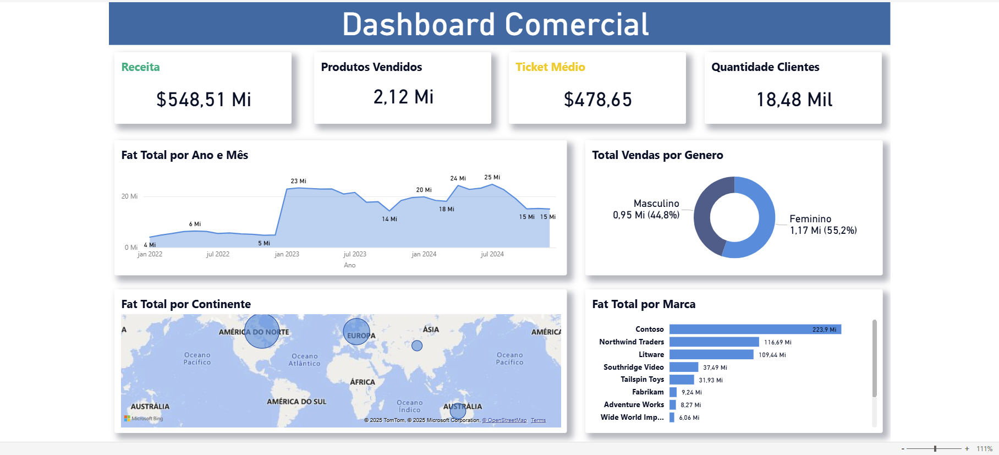

# 📊 Dashboard Comercial

Este é o meu terceiro projeto em Power BI, onde utilizei uma base de dados de vendas para criar uma dashboard simples e objetiva. O objetivo foi aplicar os conceitos básicos de extração, tratamento e visualização de dados, resultando em uma ferramenta que apresenta os principais indicadores de desempenho do negócio de forma clara e intuitiva.

## 🔗 Visualização Online

Acesse a versão interativa diretamente pelo Power BI Service:

👉 **[Clique aqui para visualizar a dashboard](https://app.powerbi.com/view?r=eyJrIjoiY2RlYjU0ODYtYWM2Mi00Yjc4LTkxMTktYjllMjg5NzZhYjlmIiwidCI6IjMwNGZjMDY5LWM5MTMtNDg0OS04YWFiLTU1ZDEzNmI4MmU2NSJ9)**

## 🖼️ Visão da Dashboard

## 📂 Estrutura do Projeto

O repositório contém:

* **Arquivo `.pbix`** → O arquivo do Power BI com o modelo de dados e os relatórios.

## 🧪 Como Testar Localmente

1.  Baixe o arquivo do projeto `dashboard-comercial-03.pbix`.
2.  Certifique-se de ter o **Power BI Desktop** instalado.
3.  Abra o arquivo `.pbix` no Power BI Desktop.
4.  Explore o modelo, o tratamento de dados no Power Query e os gráficos interativos.
